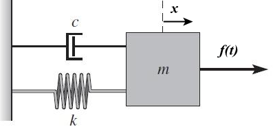

## 状态空间表达（State-Space Representation）

### 传递函数

有一个质量-弹簧-阻尼（Mass-Spring-Damping）系统，输入为 $u(t)=f(t)$，输出为 $x$：

根据牛顿第二定律，可以得到如下平衡方程：
$$
m\ddot{x}=f(t)-kx-c\dot{x}\Rightarrow m\ddot{x}+kx+c\dot{x}=f(t)
$$
经拉普拉斯变换得
$$
ms^{2} X(s)+kX(s)+csX(s) = F(s)
$$
故该系统的传递函数为
$$
G(s)=\frac{Output}{Input}=\frac{X(s)}{F(s)} =\frac{1}{ms^2+cs+k}
$$

### 状态空间

包含输入、输出和状态变量的一阶微分方程的集合。

1. 选择状态变量消除高阶项

   取系统的状态变量为 $z_1,z_2$，令 $z_1=x，z_2=\dot{x}$，即 $\dot{z_1}=\dot{x}=z_2,\dot{z_2}=\ddot{x}$ ，可得
   $$
   \begin{bmatrix}
   z_1 \\
   z_2
   \end{bmatrix}=
   \begin{bmatrix}
   0 & 1 \\
   -\frac{k}{m} & -\frac{B}{m}
   \end{bmatrix}
   \begin{bmatrix}
   z_1 \\
   z_2
   \end{bmatrix}+
   \begin{bmatrix}
   0 \\
   \frac{1}{m}
   \end{bmatrix}
   \begin{bmatrix}
   u(t)
   \end{bmatrix} 
   $$

$$
y=\begin{bmatrix}
1 \\
0
\end{bmatrix}\begin{bmatrix}
z_1 \\
z_2
\end{bmatrix}+\begin{bmatrix}
0
\end{bmatrix}\begin{bmatrix}
u(t)
\end{bmatrix}
$$

​		
